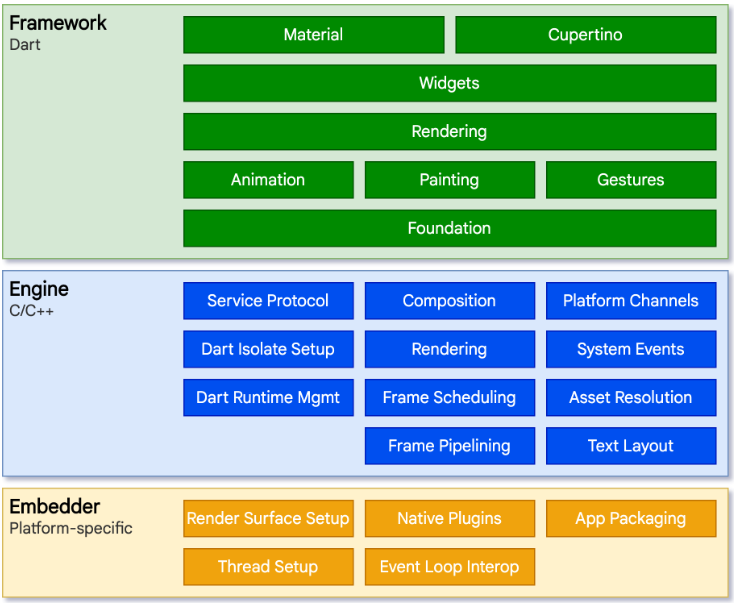

### 1.技术特点

```
1.跨平台自绘引擎: 使用自己的高性能渲染引擎来绘制 Widget(组件), 不仅可以保证在 Android 和 iOS 上 UI 的一致性, 也可以避免对原生控件依赖而带来的限制及高昂的维护成本.
2.采用Dart语言开发.
3.高性能.
```

### 2.为什么采用 Dart 语言开发而不是 JavaScript 或者其他语言?

```
程序主要有两种运行方式：静态编译(AOT)与动态解释(JIT).
AOT 的程序在执行前程序会被提前编译为机器码. 举例: C/C++
JIT 在运行时将源码实时翻译为机器码来执行. 举例: JavaScript、python等

原因:
1.开发效率高: Flutter 在开发阶段采用 JIT 模式, 在发布时可以通过 AOT 生成高效的机器码以保证应用性能.
2.高性能.
3.快速内存分配.
4.类型安全和空安全: Dart 支持静态类型检测, 可以在编译前发现一些类型的错误. JavaScript 是一个弱类型语言.
```

### 3.框架结构

```

三层：框架层、引擎层和嵌入层.

框架层: 纯 Dart实现的 SDK, 它实现了一套基础库.
1.底下两层(Foundation 和 Animation、Painting、Gestures), 底层UI库, 提供动画、手势及绘制能力.
2.Rendering 层(渲染层), 依赖于 Dart UI 层, 渲染层会构建一棵由可渲染对象组成的渲染树, 当动态更新这些对象时, 渲染树会找出变化的部分, 然后更新渲染.
3.Widgets 层(基础组件库).
4.Material 和 Cupertino 层(两种视觉风格的组件库).
```

### 4.搭建 Flutter 开发环境

```
1.搭建临时镜像(将如下环境变量添加到到用户环境变量中):
PUB_HOSTED_URL=https://pub.flutter-io.cn
FLUTTER_STORAGE_BASE_URL=https://storage.flutter-io.cn

2.下载SDK: https://flutter.cn/docs/release/archive?tab=windows. 在磁盘中新建一个文件夹然后将安装包解压到文件夹中. 在解压后目录的flutter文件下找flutter_console.bat, 双击运行并启动flutter命令行.

3.系统全局引用flutter命令: 需要添加以下环境变量到用户PATH, flutter\bin的全路径.

4.查看是否还需要安装其他依赖: flutter doctor

5.管理flutter SDK分支: flutter channel 查看或切换分支, dev和master为开发分支.

6.升级flutter SDK: flutter upgrade
```

### 5.下载 Flutter 开发工具依赖及创建运行项目

```
VS Code的配置与使用(Ctrl+Shift+P):
1.安装flutter插件: 下载 flutter 并重启. 在配置栏中输入 doctor, 然后选择 Flutter: Run Flutter Doctor 进行验证.

2.新建 flutter 项目: 在配置栏中输入 flutter, 然后选择 Flutter: New Project, 选择模板并指定文件存储位置, 输入项目名称. 等待项目创建继续, 并显示main.dart文件.

3.运行 flutter 项目: 在项目终端中输入 flutter run -d chrome --web-port=8080 --web-hostname=127.0.0.1

4.如果有更新, 在终端中输入r, 即可刷新页面.
```

### 6.Widget 简介

```
framework.dart -> 133行

// Liuk -> 在 Flutter 中, Widget 的功能是“描述一个UI元素的配置信息”，它就是说， Widget 其实并不是表示最终绘制在设备屏幕上的显示元素，所谓的配置信息就是 Widget 接收的参数
// @immutable 代表 Widget 是不可变的, 这会限制 Widget 中定义的属性（即配置信息）必须是不可变的（final）.
// 为什么不允许 Widget 中定义的属性变化呢？因为 Flutter 中如果属性发生变化则会重新构建Widget树，即重新创建新的 Widget 实例来替换旧的 Widget 实例，所以允许 Widget 的属性变化是没有意义的，因为一旦 Widget 自己的属性变了自己就会被替换.
@immutable
abstract class Widget extends DiagnosticableTree { // DiagnosticableTree 诊断树, 作用是提供调试信息.
  const Widget({ this.key });

  final Key? key; // 作用是决定是否在下一次build时复用旧的 widget ，决定的条件在canUpdate()方法中

  @protected
  @factory
  Element createElement(); // 生成对应节点的Element对象, 在 Flutter 框架中隐式调用的, 在我们开发过程中基本不会调用到.

  @override
  String toStringShort() {
    final String type = objectRuntimeType(this, 'Widget');
    return key == null ? type : '$type-$key';
  }

  @override
  void debugFillProperties(DiagnosticPropertiesBuilder properties) {
    super.debugFillProperties(properties);
    properties.defaultDiagnosticsTreeStyle = DiagnosticsTreeStyle.dense;
  }

  @override
  @nonVirtual
  bool operator ==(Object other) => super == other;

  @override
  @nonVirtual
  int get hashCode => super.hashCode;

  // 作用: 是否用新的 widget 对象去更新旧 UI 树上所对应的Element对象的配置
  static bool canUpdate(Widget oldWidget, Widget newWidget) {
    return oldWidget.runtimeType == newWidget.runtimeType
        && oldWidget.key == newWidget.key;
  }

  static int _debugConcreteSubtype(Widget widget) {
    return widget is StatefulWidget ? 1 :
           widget is StatelessWidget ? 2 :
           0;
  }
}
```

### 7.StatelessWidget 简介

```
framework.dart -> 179行

// Liuk -> 无状态的组件. 用于不需要维护状态的场景, 它通常在 build 方法中通过嵌套其他 widget 来构建UI.
abstract class StatelessWidget extends Widget {
  const StatelessWidget({ super.key });

  @override
  StatelessElement createElement() => StatelessElement(this); // 重写了createElement()方法.

  @protected
  Widget build(BuildContext context); // context参数, 表示当前 widget 在 widget 树中的上下文, 每一个 widget 都会对应一个 context 对象.
}
```

### 8.StatefulWidget 简介

```
framework.dart -> 190行

// Liuk -> 有状态的组件.
abstract class StatefulWidget extends Widget {
  const StatefulWidget({ super.key });

  @override
  StatefulElement createElement() => StatefulElement(this); // 重写了createElement()方法.

  @protected
  @factory
  State createState(); // 用于创建和 StatefulWidget 相关的状态
}
```

### 9.计数器应用示例及注释

```
main.dart
```

### 10.状态管理-Widget 管理自己的状态

```
myself.dart
```

### 11.状态管理-父Widget管理子Widget的状态

```
father.dart
```

### 12.路由管理-路由跳转及传参

```
routes.dart
```
